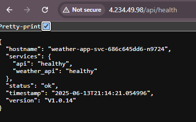

# 🌦️ Weather App

A simple Python-based weather application that fetches and displays current weather data using a public API.

## 📁 Project Structure

weather-app/

├── apps/

│ └── app.py

├── requirements.txt

├── Dockerfile

├── docker-compose.yaml

├── .env

└── README.md


## 🚀 Features

- Fetches live weather data from OpenWeatherMap API
- Lightweight and containerized using Docker
- Configurable via environment variable (`WEATHER_API_KEY`)

## 🔧 Requirements

- Python 3.11+
- Docker
- (Optional) Docker Compose

## ⚙️ Setup & Run

### 🐳 Run with Docker

1. Build the image:
   ```bash
   docker build -t weather-app .

2. Run the container:
    ```bash
    docker run --env-file .local-env -p 5000:5000 weather-app

### 🐳 Run with Docker Compose (Recommended)

Build and start the app:

``` bash
docker compose --env-file .local-env up --build
```

The response from the /api/hello


The response from the health check url: http://4.234.49.98/api/health



# Terraform Infrastructure

This repository contains Terraform configuration files for provisioning the environment on Azure. It utilizes a predefined variable file (`test.tfvars`) to configure resources and manage the infrastructure lifecycle.

## Prerequisites

- [Terraform](https://www.terraform.io/downloads.html) (v1.x+ recommended)
- [Azure CLI](https://docs.microsoft.com/en-us/cli/azure/install-azure-cli) for authentication (`az login`)
- Access to the Sure Pre-Prod Azure subscription
- Proper configuration of variables in `test.tfvars`

## Getting Started

### 1. Clone the repository

First, clone this repository to your local environment:

```bash
git clone <repository-url>
cd <repository-path>
```

### 2. Authenticate with Azure
Ensure you are authenticated with your Azure account:

```bash
az login
```
**Make sure you are in the right subscription**

This will open a browser window for you to complete the login process. Once logged in, you will have access to the appropriate Azure subscription.

###  3. Initialize Terraform
Run the following command to initialize the working directory containing Terraform configuration files. This will download the necessary provider plugins and set up your environment:

```bash
terraform init
```

### 4. Validate the Terraform Configuration
Validate the Terraform configuration to ensure it is syntactically correct:

```bash
terraform validate
```

### 5. Generate an Terraform Execution Plan

To preview the changes Terraform will make to your infrastructure, use the terraform plan command. Pass in the variable file for the testuction environment:

```bash
terraform plan --var-file=../../vars/test/test.tfvars
```
### 6. Apply Changes to Infrastructure
Apply the changes to the pre-production environment using the following command:

```bash
terraform apply --var-file=../../vars/test/test.tfvars
```
Confirm the action when prompted, and Terraform will start provisioning the infrastructure.

### 7. Destroy Infrastructure (if needed)
If you need to tear down the infrastructure, use the terraform destroy command with the same variable file:
```bash
terraform destroy --var-file=../../vars/test/test.tfvars
```

##  Directory Structure
### main.tf: 
The primary configuration file for defining the infrastructure resources.
### vars/: 
Contains the variable definition files for different environments.

# Weather App Kubernetes Deployment

## Overview

This project demonstrates a complete CI/CD pipeline for deploying a weather application to Azure Kubernetes Service (AKS) using modern DevOps practices and tools.

## Infrastructure & Architecture

### Kubernetes Cluster
- **Provisioning**: Kubernetes cluster created and managed using **Terraform**
- **Platform**: Azure Kubernetes Service (AKS)
- **Load Balancer**: NGINX Ingress Controller for traffic routing and load balancing

### Application Deployment
- **Manifest Management**: Kubernetes manifests generated using **Helm charts**
- **Package Management**: Helm templates for consistent and versioned deployments
- **Secret Management**: Kubernetes secrets configured and managed within the CI/CD pipeline

## CI/CD Pipeline

### Trigger
The deployment pipeline is triggered automatically when a **GitHub release is created**.

### Pipeline Stages

#### 1. Build and Push
- Extracts release version from GitHub release tag
- Builds Docker image with release version as build argument
- Pushes versioned image to Docker Hub
- Performs version verification test

#### 2. Deploy to AKS
- Authenticates with Azure using service principal credentials
- Connects to AKS cluster using kubectl context
- Creates/updates Kubernetes secrets with application environment variables
- Deploys application using Helm upgrade/install
- Monitors deployment rollout status

### Key Features
- **Version Management**: Automatic extraction and injection of release versions
- **Secret Management**: Secure handling of API keys and credentials via Kubernetes secrets
- **Health Checks**: Automated verification of deployment status
- **Rollout Monitoring**: Real-time tracking of deployment progress

## Environment Variables & Secrets

The following secrets are managed within the CI/CD pipeline:
- `DOCKERHUB_USERNAME` - Docker Hub authentication
- `DOCKERHUB_PASSWORD` - Docker Hub authentication  
- `WEATHER_API_KEY` - External weather service API key
- `AZURE_CREDENTIALS_TEST` - Azure service principal credentials

## Deployment Configuration

- **Helm Template**: Custom Helm chart for Kubernetes manifests
- **Namespace**: Dedicated Kubernetes namespace for application isolation
- **Image Repository**: Docker Hub registry for container images
- **Load Balancing**: NGINX Ingress for external traffic management

## Live Application

🌐 **Access the deployed application**: [http://4.234.49.98/api/hello](http://4.234.49.98/api/hello)

As you can see from the screenshot that the V1.0.14 has been released to main.


The response also gives us the same version


The response from the health check url: http://4.234.49.98/api/health


The endpoint returns the current release version, demonstrating successful deployment and version tracking.

## Technologies Used

- **Infrastructure**: Terraform, Azure Kubernetes Service (AKS)
- **Containerization**: Docker, Docker Hub
- **Orchestration**: Kubernetes, Helm
- **Load Balancing**: NGINX Ingress Controller
- **CI/CD**: GitHub Actions
- **Secret Management**: Kubernetes Secrets


## Deployment Flow

1. **Release Creation** → Triggers GitHub Actions workflow
2. **Image Build** → Docker image built with release version
3. **Image Push** → Versioned image pushed to Docker Hub
4. **Version Verification** → Automated testing of built image
5. **AKS Authentication** → Secure connection to Kubernetes cluster
6. **Secret Creation** → Environment variables injected as Kubernetes secrets
7. **Helm Deployment** → Application deployed using Helm charts
8. **Rollout Verification** → Deployment status monitoring and validation

This implementation showcases enterprise-grade DevOps practices with automated testing, security-first secret management, and reliable deployment strategies.

# 📊 Monitoring & Observability

To ensure high availability and performance of the weather service deployed in AKS, a complete observability stack is in place. This includes logging, metrics, and tracing to help monitor system health and debug production issues efficiently.

---

## 🔍 Logs – Loki + Azure Log Analytics

- **Loki** is used to collect logs from all AKS pods, which are queryable through **Grafana**.
- Logs provide insights into:
  - API access and response codes
  - Weather API errors
  - Internal application exceptions
- **Azure Log Analytics** complements cluster-wide diagnostics like:
  - Node and pod health
  - Kube events and resource usage

---

## 📈 Metrics – Prometheus + Grafana

- **Prometheus** scrapes metrics from the service, Kubernetes nodes, and system components.
- Metrics include:
  - Request rate and error rate
  - Container CPU and memory usage
  - Uptime and API latency
- **Grafana** visualizes these metrics with real-time dashboards and supports alerts.

---

## 📡 Tracing – OpenTelemetry (Pluggable)

- **OpenTelemetry** is integrated for distributed tracing.
- It enables visibility into:
  - API request paths
  - External API call latency (e.g., OpenWeatherMap)
  - End-to-end request flow across services
- Future-ready for export to **Jaeger** or **Azure Application Insights**.

---

## 🧠 Summary

| Category | Tool(s)                    | Purpose                                 |
|----------|----------------------------|-----------------------------------------|
| Logs     | Loki, Azure Log Analytics  | Centralized logging & diagnostics       |
| Metrics  | Prometheus, Grafana        | Monitoring and alerting                 |
| Tracing  | OpenTelemetry              | Distributed request tracing             |

---

This setup ensures complete observability of the weather service — making the system easier to maintain, debug, and scale in production.
