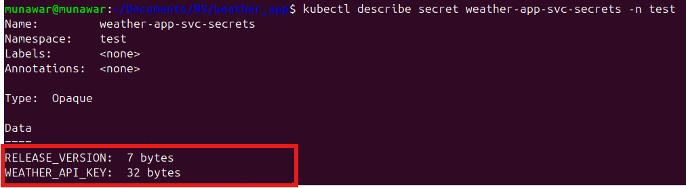

# 🌦️ Weather App - Part - A

A simple Python-based weather application that fetches and displays current weather data using a public API.

## 📁 Project Structure
```
weather-app/
├── .github/
│   └── workflows/
│       └── build-and-deploy.yaml     # CI/CD pipeline for building and deploying the app
│   └── variables/
│       └── test.env                  # Environment variable file for testing
├── Images/   
│   ├── image.png                    # Sample UI screenshot or architecture
│   ├── image-1.png                  # Additional UI screenshots
│   ├── image-2.png                  # Additional UI screenshots
├── Part B - System Architecture Design/
│   ├── README.md                     # System architecture documentation
│   └── System_Architecture.png      # Visual diagram of the system design
├── apps/
│   └── app.py                        # Flask or backend application source code
├── terraform/
│   ├── .terraform.lock.hcl          # Terraform dependency lock file
│   ├── main.tf                      # Root Terraform configuration
│   ├── variables.tf                 # Input variables
│   ├── envs/
│   │   └── test/                    # Test environment configurations
│   ├── vars/
│   │   └── test/
│   │       └── test.tfvars          # Variable values for test environment
│   └── modules/
│       ├── aks/
│       │   ├── main.tf              # AKS cluster configuration
│       │   ├── outputs.tf           # AKS module outputs
│       │   └── variables.tf         # AKS module variables
│       └── virtual_network/
│           ├── main.tf              # Virtual network configuration
│           ├── outputs.tf           # Network module outputs
│           └── variables.tf         # Network module variables
├── weather-app-svc/                 # Kubernetes Manifest Files using helm
│   ├── templates
│   ├── chart.yaml
│   ├── values.yaml       
├── .gitignore
├── .local-env                   # Local environment variables
├── Dockerfile                   # Dockerfile for the weather app
├── docker-compose.yaml         # For local multi-container development
├── requirements.txt                 # Python dependencies
├── .gitignore                       # Git ignore rules
└── README.md                        # Main project documentation
```

## 🚀 Features

- Fetches live weather data from OpenWeatherMap API
- Lightweight and containerized using Docker
- Configurable via environment variable (`WEATHER_API_KEY`)

## 🔧 Requirements

- Python 3.11+
- Docker
- (Optional) Docker Compose

## ⚙️ Setup & Run

### 🐳 Run with Docker

1. Build the image:
   ```bash
   docker build -t weather-app .

2. Run the container:
    ```bash
    docker run --env-file .local-env -p 5000:5000 weather-app

### 🐳 Run with Docker Compose (Recommended)

Build and start the app:

``` bash
docker compose --env-file .local-env up --build
```

The response from the /api/hello


The response from the health check url: http://4.234.49.98/api/health


# Terraform Infrastructure

This repository contains Terraform configuration files for provisioning the environment on Azure. It utilizes a predefined variable file (`test.tfvars`) to configure resources and manage the infrastructure lifecycle.

## Prerequisites

- [Terraform](https://www.terraform.io/downloads.html) (v1.x+ recommended)
- [Azure CLI](https://docs.microsoft.com/en-us/cli/azure/install-azure-cli) for authentication (`az login`)
- Access to the Sure Pre-Prod Azure subscription
- Proper configuration of variables in `test.tfvars`

## Getting Started

### 1. Clone the repository

First, clone this repository to your local environment:

```bash
git clone <repository-url>
cd <repository-path>
```

### 2. Authenticate with Azure
Ensure you are authenticated with your Azure account:

```bash
az login
```
**Make sure you are in the right subscription**

This will open a browser window for you to complete the login process. Once logged in, you will have access to the appropriate Azure subscription.

###  3. Initialize Terraform
Run the following command to initialize the working directory containing Terraform configuration files. Go inside weather-app/terraform/envs/test directory first. This will download the necessary provider plugins and set up your environment:

```bash
terraform init
```

### 4. Validate the Terraform Configuration
Validate the Terraform configuration to ensure it is syntactically correct:

```bash
terraform validate
```

### 5. Generate an Terraform Execution Plan

To preview the changes Terraform will make to your infrastructure, use the terraform plan command. Pass in the variable file for the testuction environment:

```bash
terraform plan --var-file=../../vars/test/test.tfvars
```
### 6. Apply Changes to Infrastructure
Apply the changes to the pre-production environment using the following command:

```bash
terraform apply --var-file=../../vars/test/test.tfvars
```
Confirm the action when prompted, and Terraform will start provisioning the infrastructure.

### 7. Destroy Infrastructure (if needed)
If you need to tear down the infrastructure, use the terraform destroy command with the same variable file:
```bash
terraform destroy --var-file=../../vars/test/test.tfvars
```

##  Directory Structure
### main.tf: 
The primary configuration file for defining the infrastructure resources.
### vars/: 
Contains the variable definition files for different environments.

# Weather App Kubernetes Deployment

## Overview

This project demonstrates a complete CI/CD pipeline for deploying a weather application to Azure Kubernetes Service (AKS) using modern DevOps practices and tools.

## Infrastructure & Architecture

### Kubernetes Cluster
- **Provisioning**: Kubernetes cluster created and managed using **Terraform**
- **Platform**: Azure Kubernetes Service (AKS)
- **Load Balancer**: NGINX Ingress Controller for traffic routing and load balancing

### Application Deployment
- **Manifest Management**: Kubernetes manifests generated using **Helm charts**
- **Package Management**: Helm templates for consistent and versioned deployments
- **Secret Management**: Kubernetes secrets configured and managed within the CI/CD pipeline

## CI/CD Pipeline

### Trigger
The deployment pipeline is triggered automatically when a **GitHub release is created**.

### Pipeline Stages

#### 1. Build and Push
- Extracts release version from GitHub release tag
- Builds Docker image with release version as build argument
- Pushes versioned image to Docker Hub
- Performs version verification test

#### 2. Deploy to AKS
- Authenticates with Azure using service principal credentials
- Connects to AKS cluster using kubectl context
- Creates/updates Kubernetes secrets with application environment variables
- Deploys application using Helm upgrade/install
- Monitors deployment rollout status

### Key Features
- **Version Management**: Automatic extraction and injection of release versions
- **Secret Management**: Secure handling of API keys and credentials via Kubernetes secrets
- **Health Checks**: Automated verification of deployment status
- **Rollout Monitoring**: Real-time tracking of deployment progress

## Environment Variables & Secrets

The following secrets are managed within the CI/CD pipeline:
- `DOCKERHUB_USERNAME` - Docker Hub authentication
- `DOCKERHUB_PASSWORD` - Docker Hub authentication  
- `WEATHER_API_KEY` - External weather service API key
- `AZURE_CREDENTIALS_TEST` - Azure service principal credentials

## Deployment Configuration

- **Helm Template**: Custom Helm chart for Kubernetes manifests
- **Namespace**: Dedicated Kubernetes namespace for application isolation
- **Image Repository**: Docker Hub registry for container images
- **Load Balancing**: NGINX Ingress for external traffic management

As you can see from the commands the service and deployment for the application is done and the pod is running currently.


There are 2 Secrets configured through kubernetes secrets. 
WEATHER_API_KEY
RELEASE_VERSION



## Live Application

🌐 **Access the deployed application**: [http://4.234.49.98/api/hello](http://4.234.49.98/api/hello)

As you can see from the screenshot that the V1.0.14 has been released to main.


The response also gives us the same version


The response from the health check url: http://4.234.49.98/api/health


The endpoint returns the current release version, demonstrating successful deployment and version tracking.

## Technologies Used

- **Infrastructure**: Terraform, Azure Kubernetes Service (AKS)
- **Containerization**: Docker, Docker Hub
- **Orchestration**: Kubernetes, Helm
- **Load Balancing**: NGINX Ingress Controller
- **CI/CD**: GitHub Actions
- **Secret Management**: Kubernetes Secrets


## Deployment Flow

1. **Release Creation** → Triggers GitHub Actions workflow
2. **Image Build** → Docker image built with release version
3. **Image Push** → Versioned image pushed to Docker Hub
4. **Version Verification** → Automated testing of built image
5. **AKS Authentication** → Secure connection to Kubernetes cluster
6. **Secret Creation** → Environment variables injected as Kubernetes secrets
7. **Helm Deployment** → Application deployed using Helm charts
8. **Rollout Verification** → Deployment status monitoring and validation

This implementation showcases enterprise-grade DevOps practices with automated testing, security-first secret management, and reliable deployment strategies.

# 📊 Monitoring & Observability

To ensure high availability and performance of the weather service deployed in AKS, a complete observability stack is in place. This includes logging, metrics, and tracing to help monitor system health and debug production issues efficiently.

---

## 🔍 Logs – Loki + Azure Log Analytics

- **Loki** is used to collect logs from all AKS pods, which are queryable through **Grafana**.
- Logs provide insights into:
  - API access and response codes
  - Weather API errors
  - Internal application exceptions
- **Azure Log Analytics** complements cluster-wide diagnostics like:
  - Node and pod health
  - Kube events and resource usage

---

## 📈 Metrics – Prometheus + Grafana

- **Prometheus** scrapes metrics from the service, Kubernetes nodes, and system components.
- Metrics include:
  - Request rate and error rate
  - Container CPU and memory usage
  - Uptime and API latency
- **Grafana** visualizes these metrics with real-time dashboards and supports alerts.

---

## 📡 Tracing – OpenTelemetry (Pluggable)

- **OpenTelemetry** is integrated for distributed tracing.
- It enables visibility into:
  - API request paths
  - External API call latency (e.g., OpenWeatherMap)
  - End-to-end request flow across services
- Future-ready for export to **Jaeger** or **Azure Application Insights**.

---

## 🧠 Summary

| Category | Tool(s)                    | Purpose                                 |
|----------|----------------------------|-----------------------------------------|
| Logs     | Loki, Azure Log Analytics  | Centralized logging & diagnostics       |
| Metrics  | Prometheus, Grafana        | Monitoring and alerting                 |
| Tracing  | OpenTelemetry              | Distributed request tracing             |

---

This setup ensures complete observability of the weather service — making the system easier to maintain, debug, and scale in production.

# PART - B: Scalable E-commerce Cloud Architecture


## System Flow

### 1. DNS Resolution
Users access the application through domain names (e.g., `api.ecommerce.com`). The Domain Name System (DNS) returns the IP address of our Azure Application Gateway to the browser or mobile app.

### 2. Content Delivery Network (CDN)
Azure CDN is positioned as the first layer to serve static content:

Caches static assets like images, CSS, JavaScript files, and product images
Serves content from edge locations closest to the user
Reduces load on origin servers and improves page load times globally
Handles cache expiry and invalidation for updated content

### 3. Application Gateway & Load Balancing
Once the IP address is obtained, HTTP requests are sent to the Azure Application Gateway. It acts as a **Load Balancer.** A load balancer evenly distributes incoming traffic among web servers that are defined in a
load-balanced set. The Application Gateway evenly distributes incoming traffic among AKS nodes using private IPs for secure communication between services. 

### 4. Azure Kubernetes Service (AKS)
Azure Kubernetes Service (AKS) hosts all the backend logic of the application using containerized microservices. Each microservice is responsible for a specific domain—such as authentication, catalog, cart, or order processing.

These services are:

- Deployed as pods inside the AKS cluster
- Exposed through internal service endpoints and accessible via an ingress controller
- Horizontally scalable, meaning AKS can increase or decrease the number of pods based on traffic and load
- Isolated, so that heavy processing in one service does not impact the performance of others

With AKS, the backend benefits from:
- Automated service discovery
- Resilient deployments with health checks and restarts
- Load balancing across service instances
- Seamless updates with zero downtime using rolling deployments
- Each service can be scaled independently based on traffic demands.

### 5. Database Layer - Master-Slave Configuration
The backend handles different types of read and write APIs through a master-slave database setup:
- **Master Database**: Handles all write operations (insert, delete, update)
- **Slave Databases**: Handle read operations with data copied from master
- **Zone-Redundant Storage**: Data replication across Zone 1 and Zone 2 for high availability

### 6. Background Processing
For handling large amounts of data:
- **Azure Service Bus**: Message queue system for asynchronous communication
- **Azure Functions**: Serverless background workers that process queued messages
- **Batch Jobs**: Handle bulk data imports, analytics, and reporting tasks

### 7. Caching Layer
**Redis Cache** serves as a temporary data store layer, much faster than the database:
- Caches frequently accessed product data
- Stores user session information
- Reduces database workload significantly

### 8. External System Integration
The application relies on external systems for fetching product lists:
- **Dedicated Catalog Service**: A dedicated backend microservice within the AKS cluster is responsible for communicating with external product APIs. This ensures that integration logic is isolated from other critical workflows.
- **Asynchronous Fetching with Background Workers**: To avoid delays in user-facing APIs, product data is often fetched asynchronously using Azure Service Bus and Azure Functions. This offloads the work to background jobs, allowing for scheduled or triggered syncs.
- **Caching Layer with Redis**: Fetched product data is cached in Redis to ensure fast responses for high-frequency queries like product browsing or search. Redis reduces repeated external API calls, improves latency, and ensures the app stays responsive even if the external system is slow or temporarily down.


### 9. Scalability of the System
This architecture is designed with horizontal scalability, decoupled components, and auto-scaling mechanisms to efficiently handle high traffic and variable loads across the globe.
- **Microservices on Kubernetes (AKS)**: Each service (e.g., authentication, catalog, order) runs independently in containers and can be scaled out horizontally based on demand. This ensures that increasing load on one part of the system doesn’t degrade others.
- **Auto-Scaling**: The system supports horizontal pod autoscaling and cluster autoscaling, allowing infrastructure to expand and contract based on CPU/memory usage or custom traffic metrics—resulting in optimized cost and performance.
- **Load Balancing at Multiple Layers**: Global requests are routed through Azure Application Gateway or Front Door, distributing traffic intelligently across zones and regions. Internal services are balanced through Kubernetes services and ingress controllers.
- **Message Queue for Traffic Bursting**: High-volume background tasks are offloaded to Azure Service Bus Queues, decoupling real-time processing from asynchronous workloads. This prevents overload and enables background services to scale independently.
- **Read/Write Database Separation**: A PostgreSQL primary-replica setup supports write-heavy operations on the master and read-heavy queries on replicas—avoiding bottlenecks during peak shopping periods.
- **Redis Caching Tier**: Reduces load on databases and external APIs by serving frequently accessed data instantly. Redis scales horizontally to maintain low latency as demand increases.

### 10. Monitoring & Observability
**Prometheus & Grafana**: 
- Collect and visualize Kubernetes cluster metrics
- Monitor application performance and resource utilization
- Set up alerts for system health issues

**Azure Log Analytics**:
- Centralized logging for all Azure services
- Application logs and error tracking
- Security audit logs and compliance monitoring

## Global Traffic Handling

The architecture handles global traffic with variable peak hours through:
- **Multi-region deployment** across different Azure regions
- **Auto-scaling groups** that adjust based on traffic patterns
- **Content Delivery Network (CDN)** for static content delivery
- **Regional database replicas** for improved read performance

## Cost Optimization Features

- **Auto-scaling**: Scales resources up during peak hours, down during low traffic
- **Spot Instances**: Used for non-critical background processing tasks
- **Reserved Instances**: For baseline capacity requirements
- **Intelligent Storage Tiering**: Moves infrequently accessed data to cheaper storage tiers

This architecture ensures the e-commerce platform can scale from thousands to millions of concurrent users while maintaining high availability, performance, and cost-effectiveness.