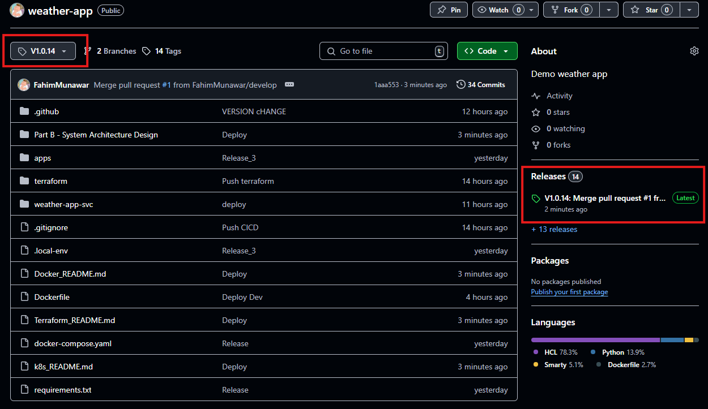
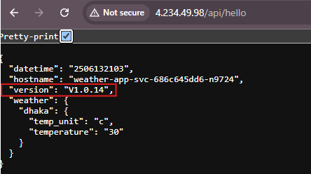

# Weather App Kubernetes Deployment

## Overview

This project demonstrates a complete CI/CD pipeline for deploying a weather application to Azure Kubernetes Service (AKS) using modern DevOps practices and tools.

## Infrastructure & Architecture

### Kubernetes Cluster
- **Provisioning**: Kubernetes cluster created and managed using **Terraform**
- **Platform**: Azure Kubernetes Service (AKS)
- **Load Balancer**: NGINX Ingress Controller for traffic routing and load balancing

### Application Deployment
- **Manifest Management**: Kubernetes manifests generated using **Helm charts**
- **Package Management**: Helm templates for consistent and versioned deployments
- **Secret Management**: Kubernetes secrets configured and managed within the CI/CD pipeline

## CI/CD Pipeline

### Trigger
The deployment pipeline is triggered automatically when a **GitHub release is created**.

### Pipeline Stages

#### 1. Build and Push
- Extracts release version from GitHub release tag
- Builds Docker image with release version as build argument
- Pushes versioned image to Docker Hub
- Performs version verification test

#### 2. Deploy to AKS
- Authenticates with Azure using service principal credentials
- Connects to AKS cluster using kubectl context
- Creates/updates Kubernetes secrets with application environment variables
- Deploys application using Helm upgrade/install
- Monitors deployment rollout status

### Key Features
- **Version Management**: Automatic extraction and injection of release versions
- **Secret Management**: Secure handling of API keys and credentials via Kubernetes secrets
- **Health Checks**: Automated verification of deployment status
- **Rollout Monitoring**: Real-time tracking of deployment progress

## Environment Variables & Secrets

The following secrets are managed within the CI/CD pipeline:
- `DOCKERHUB_USERNAME` - Docker Hub authentication
- `DOCKERHUB_PASSWORD` - Docker Hub authentication  
- `WEATHER_API_KEY` - External weather service API key
- `AZURE_CREDENTIALS_TEST` - Azure service principal credentials

## Deployment Configuration

- **Helm Template**: Custom Helm chart for Kubernetes manifests
- **Namespace**: Dedicated Kubernetes namespace for application isolation
- **Image Repository**: Docker Hub registry for container images
- **Load Balancing**: NGINX Ingress for external traffic management

## Live Application

🌐 **Access the deployed application**: [http://4.234.49.98/api/hello](http://4.234.49.98/api/hello)

As you can see from the screenshot that the V1.0.14 has been released to main.

The response also gives us the same version

The endpoint returns the current release version, demonstrating successful deployment and version tracking.

## Technologies Used

- **Infrastructure**: Terraform, Azure Kubernetes Service (AKS)
- **Containerization**: Docker, Docker Hub
- **Orchestration**: Kubernetes, Helm
- **Load Balancing**: NGINX Ingress Controller
- **CI/CD**: GitHub Actions
- **Secret Management**: Kubernetes Secrets

## Deployment Flow

1. **Release Creation** → Triggers GitHub Actions workflow
2. **Image Build** → Docker image built with release version
3. **Image Push** → Versioned image pushed to Docker Hub
4. **Version Verification** → Automated testing of built image
5. **AKS Authentication** → Secure connection to Kubernetes cluster
6. **Secret Creation** → Environment variables injected as Kubernetes secrets
7. **Helm Deployment** → Application deployed using Helm charts
8. **Rollout Verification** → Deployment status monitoring and validation

This implementation showcases enterprise-grade DevOps practices with automated testing, security-first secret management, and reliable deployment strategies.